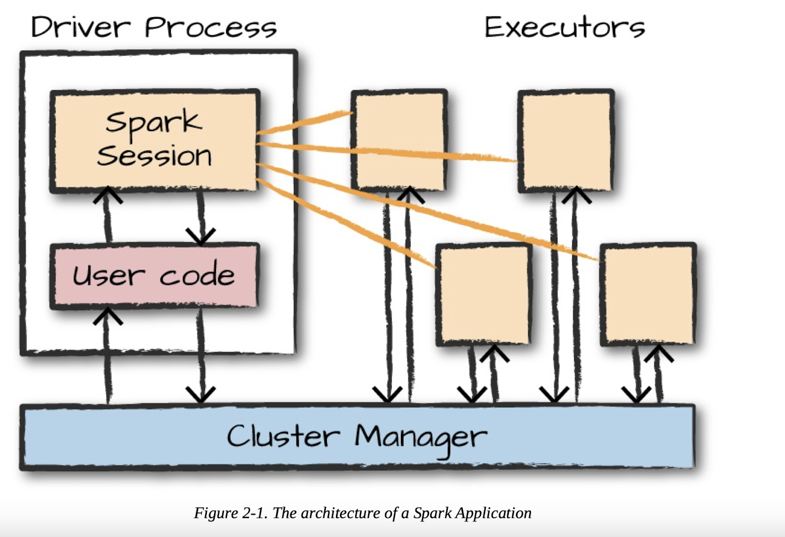
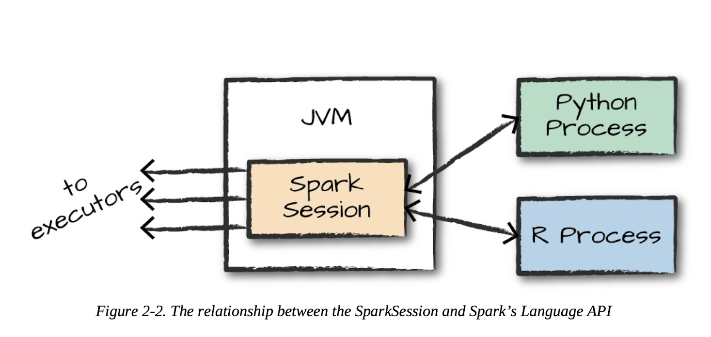
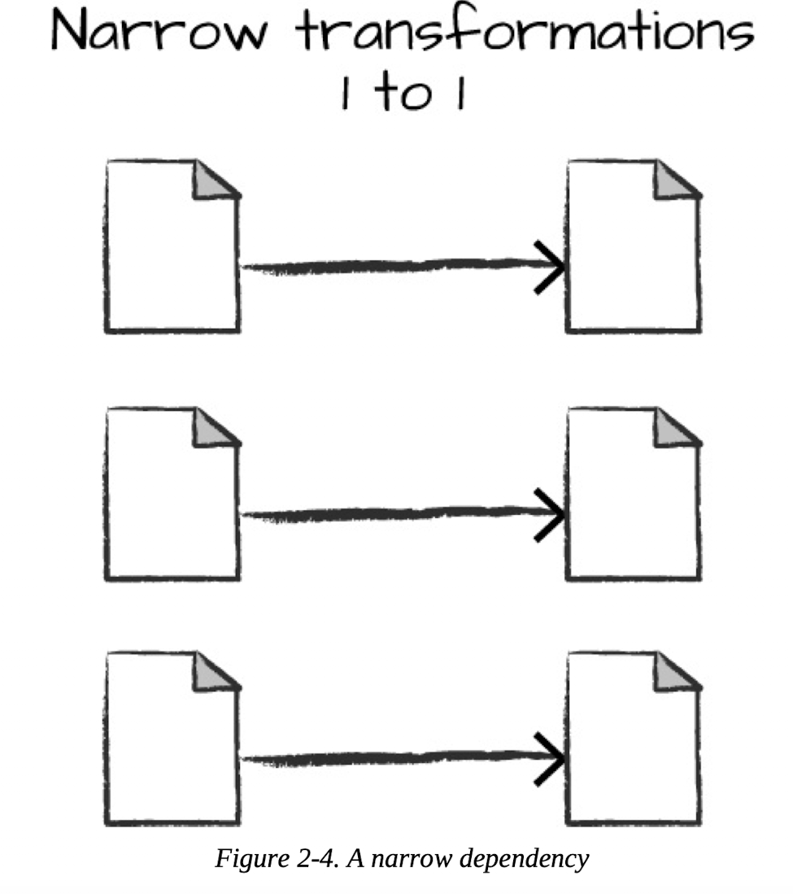
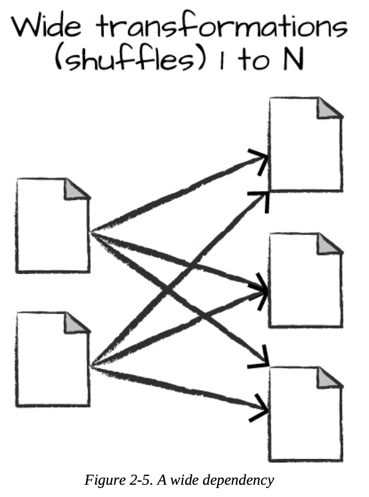

# Chapter 2 Intro to Spark

## Spark Architecture
- Spark coordinates between a **cluster** (group of computers) the execution of data tasks
- Spark Apps consist of *driver* process and a set of *executor* process.
    - *driver* contains `main()` and orchestrates the work across *executors*
    - *executors* are responsible for carrying the work drivers assign them
- Spark could also run on **local** mode, driver and executors running as threads



## Language APIs
Spark has API for Scala, Java, Python and R but all langauge API will be translated to code that could be run on the executor JVMs


## Spark DFs
Spark DFs exist in multiple machines instead of a single machine. Spark breaks up the data into chunks called **partitions**

## Transformations

### Narrow transformations
One partition contributing to one ouput partition



### Wide transformations
One input partition contributing to multiple output partitions



### Key differences
- Narrow: Spark perfomrs *pipelining*, specify multiple filters on DataFrames
- Wide: Spark exchange partitions across clsuters, *shuffle*


## Lazy Evaluation
Spark perfomrs the execution of computations at the very last moment. Spark *optimizes* the execution for us

## Actions
To trigger computations, we run an *action*
```scala
val myRange = spark.range(1000).toDF("number")
val divisBy2 = myRange.where("number % 2 == 0") // narrow
dfName.count() // wide (aggregation)
```

### explain()
Explain plans shows us the physical plan of the computation. Useful for debugging
```scala
scala> flightData2015.sort("count").explain()
== Physical Plan ==
AdaptiveSparkPlan isFinalPlan=false
+- Sort [count#56 ASC NULLS FIRST], true, 0
   +- Exchange rangepartitioning(count#56 ASC NULLS FIRST, 200), ENSURE_REQUIREMENTS, [plan_id=130]
      +- FileScan csv [DEST_COUNTRY_NAME#54,ORIGIN_COUNTRY_NAME#55,count#56] Batched: false, DataFilters: [], Format: CSV, Location: InMemoryFileIndex(1 paths)[PartitionFilters: [], PushedFilters: [], ReadSchema: struct<DEST_COUNTRY_NAME:string,ORIGIN_COUNTRY_NAME:string,count:int>
```

### partition config
We can set the no. of partitions used.
```scala
spark.conf.set("spark.sql.shuffle.partitions", "5")
```
Spark do not manipulate physical data, but it configure physical executions, so same input = same output is guranteed


## Spark SQL
Convert DF to table with
```scala
dfName.createOrReplaceTempView("table_name")
```

Querying from the table
```scala
val maxSql = spark.sql("""
SELECT DEST_COUNTRY_NAME, sum(count) as destination_total
FROM flight_data_2015
GROUP BY DEST_COUNTRY_NAME
ORDER BY sum(count) DESC
LIMIT 5
"""
)
```

It is **equivalent** to
```scala
flightData2015
    .groupBy("DEST_COUNTRY_NAME")
    .sum("count")
    .withColumnRenamed("sum(count)", "destination_total") // no computation done yet. spark is able to know the transformation of column
    .sort(desc("destination_total"))
    .limit(5)
    .show() //action
````
