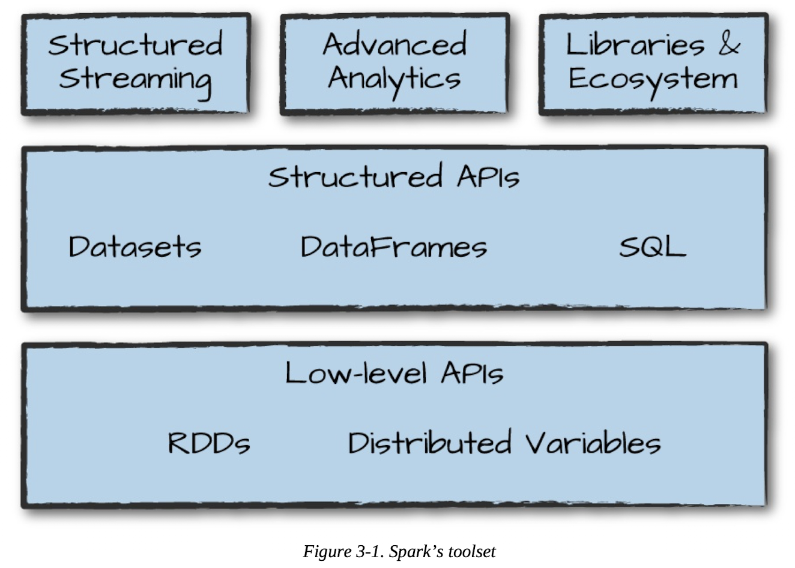

# Chapter 3 Spark's Toolset

## Overview
Spark's toolset is composed of Low-level APIs, Structured APIs and high level functions



## Running Production Applications
Use `spark-submit` to execute application code to a cluster. It will run until exit. We set the `class` and `jar` then which machine using `master`

```shell
./bin/spark-submit \
    --class org.apache.spark.examples.SparkPi \
    --master local \
    ./examples/jars/spark-examples_2.12-3.5.2.jar 10
```

## Datasets: Type-safe structured APIs

**Type-safe**: Ability to assign Java/Scala class to the records within a DF and manipulate it as a collection of typed objects

- Not available for Python / R because they are **dynamically typed** not **statically typed**

DFs are distributed collection of objects of type Row, Datasets allow manipulation of DF objects as a collection of typed objects (that may be user defined). This makes Datasets useful for writing large applications

```scala
case class Flight(DEST_COUNTRY_NAME: String, ORIGIN_COUNTRY_NAME: String, count: BigInt)
val flightsDF - spark.read.parquet("parquet file")
val flights = flightsDF.as[Flight]
```

## Structured Streaming
High-level API for strea procesing, allows you to **take the same operations performed in batch mode and run in streaming fashion** (without code changes).

### Static DF
Read DF
```scala
val staticDataFrame = spark.read.format("csv")
    .option("header", "true")
    .option("inferSchema", "true")
    .load("./data/retail-data/by-day/*.csv")
```

Select rows and action
```scala
staticDataFrame.createOrReplaceTempView("retail_data") // create schema
val staticSchema = staticDataFrame.schema // take schema as val

import org.apache.spark.sql.functions.{window, column, desc, col}
// perform select & action
staticDataFrame
    .selectExpr(
        "CustomerId",
        "(UnitPrice * Quantity) as total_cost",
        "InvoiceDate"
        )
    .gropuBy(
        col("CustomerId"), window(col("InvoiceDate"), "1 day"))
    .sum("total_cost")
    .show(5)
```

### Streaming
Read as stream

```scala
val streamingDataFrame = spark.readStream.schema(staticSchema)
    .option("maxFilesPerTrigger", 1)
    .format("csv")
    .option("header", "true")
    .load("./data/retail-data/by-day/*.csv")

streamingDataFrame.isStreaming // returns true if streaming
```

Set transformation (**lazy execution**)
```scala
val purchaseByCustomerPerHour = streamingDataFrame
    .selectExpr(
        "CustomerId",
        "(UnitPrice * Quantity) as total_cost",
        "InvoiceDate")
        .groupBy(
        $"CustomerId", window($"InvoiceDate", "1 day"))
        .sum("total_cost")
```

Streaming action (Populating data somewhere after each action). This action will output to an in-memory table that update after each trigger

```scala
purchaseByCustomerPerHour
    .writeStream
    .format("memory")
    .queryName("customer_purchases")
    .outputMode("complete")
    .start()
```


## ML and Analytics
Use the `org.apache.spark.ml` library for ML

### Preprocessing Pipeline
```scala
import org.apache.spark.ml.feature.StringIndexer
import org.apache.spark.ml.feature.OneHotEncoder

val indexer = new StringIndexer()
    .setInputCol("day_of_week")
    .setOutputCol("day_of_week_index")
val encoder = new OneHotEncoder()
    .setInputCol("day_of_week_index")
    .setOutputCol("day_of_week_encoded")

import org.apache.spark.ml.feature.VectorAssembler

val vectorAssembler = new VectorAssembler()
    .setInputCols(Array("UnitPrice", "Quantity", "day_of_week_encoded"))
    .setOutputCol("features")
```

Making the pipeline
```scala
val transformationPipeline = new Pipeline().setStages(Array(indexer, encoder, vectorAssembler))

val transformedTraining = fittedPipeline.transform(trainDataFrame)
```

### Fitting to model
```scala
import org.apache.spark.ml.clustering.KMeans

val kmeans = new KMeans().setK(20).setSeed(1L)
val kmModel = kmeans.fit(transformedTraining)
```

### Using cache as action to perform & save preproc
```scala
transformedTraining.cache()
```

## Lower level APIs
Everything on spark is built on RDDs (Ressilient Distributed Datasets). Spark includes a number of lower-level primitives for Java & Python object manipulation via RDD.

RDDs are lower level than DFs because they reveal **physical execution characteristics** (like partitions) to users.

RDDs are available in Scala & Python but are **not equivalent**. In modern spark, no need to use low level RDDs
